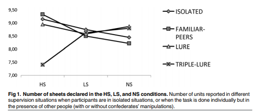
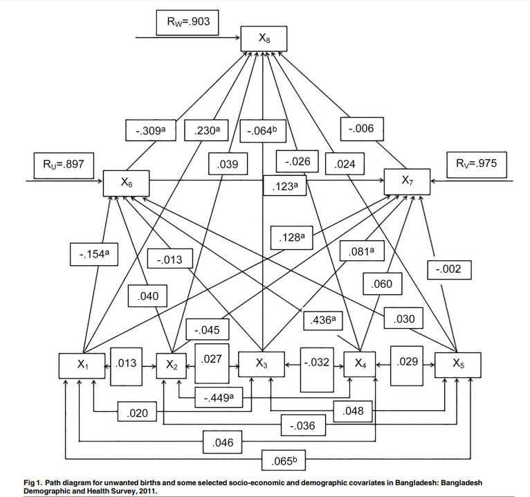
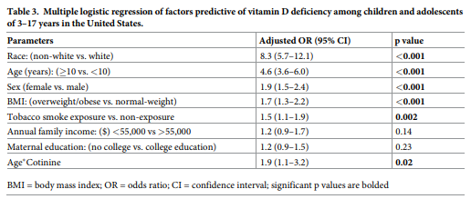

# Homework 5 - Pablo Mandiola

## Assignment 1

For this assignment we had to peer review a classmate's Citibike assignment from last week. My assigned classmate was Jiawen Wan, and the submitted review is located in her [PUI Github repository here](https://github.com/rylanwan/PUI2018_jw3290/tree/master/HW4_jw3290).

## Assignment 2

For this assignment I worked with Samuel Hight. We analyzed the same papers independently and then discussed together how to interpret specific parts.

The assignment was to analyze 3 papers that did different type of statistical tests, and fill the following table:

| **Statistical Analyses**	|  **IV(s)**  |  **IV type(s)** |  **DV(s)**  |  **DV type(s)**  |  **Control Var** | **Control Var type**  | **Question to be answered** | **_H0_** | **alpha** | **link to paper**| 
|:----------:|:----------|:------------|:-------------|:-------------|:------------|:------------- |:------------------|:----:|:-------:|:-------|
ANOVA	| 1: level of supervision, 2: prescence of others, 3: prescence of a "confederate" (ally of the experimenter) | 1: ordinal, 2: categorical, 3: categorical | 1: difference in number of assignments completed and number claimed to have been completed by participant | discrete numerical | none | none | Do participants under less supervision or who witness close associates tend to cheat more often on incetivized tasks? | Difference in assignments completed and claimed, test group <= Difference in assignments completed and claimed, control group | 0.01 | [Peer Effects in Unethical Behavior: Standing or Reputation?](https://journals.plos.org/plosone/article?id=10.1371/journal.pone.0122305) |
Path Analysis	| 1: women age, 2: residence, 3: religion, 4: socioeconomic status, 5: use of FP methods, 6: women education, 7: age at marriage | 1: ordinal, 2: categorical, 3: categorical, 4: ordinal, 5: categorical, 6: ordinal, 7: ordinal | 1, unwanted birth | continuous numerical | none | none | Determine the direct, indirect and total effects of socio-demographic factors on unwanted births | direct, indirect and total effect (coefficients) for each IV = 0 | 0.05 | [Correlates of Unwanted Births in Bangladesh: A Study through Path Analysis](https://journals.plos.org/plosone/article?id=10.1371/journal.pone.0164007) |
| Logistic Regression |1, tobacco smoke exposure measured by serum cotinine concentration|ordinal|1, vitamin D deficiency|dichotomous|1: age, 2: sex, 3: race, 4: BMI, 5: maternal education, 6: family socio-economic status|1: ordinal, 2: categorical, 3: categorical, 4: ordinal, 5: ordinal, 6: ordinal| Does tobacco smoke exposure increase the prevalence of vitamin D deficiency in US children? |Effect of tobacco smoke exposure (coefficient) = 0|0.05|[Tobacco smoke exposure is an independent predictor of vitamin D deficiency in US children](https://journals.plos.org/plosone/article?id=10.1371/journal.pone.0205342)|

**Plot from "Peer Effects in Unethical Behavior: Standing or Reputation?"**

**Plot from "Correlates of Unwanted Births in Bangladesh: A Study through Path Analysis"**

**Plot from "Tobacco smoke exposure is an independent predictor of vitamin D deficiency in US children"**

## Assignment 3

For this assignment we had to reproduce the analysis of the Hard to Employ program in New York, performing a Z-test and a Chi Square test.

## Assignment 4

For this assignment we had to first classify Citibike trips into day or night, and then do 3 tests of correlation between them: KS test, Pearson test, and Spearnman test.
