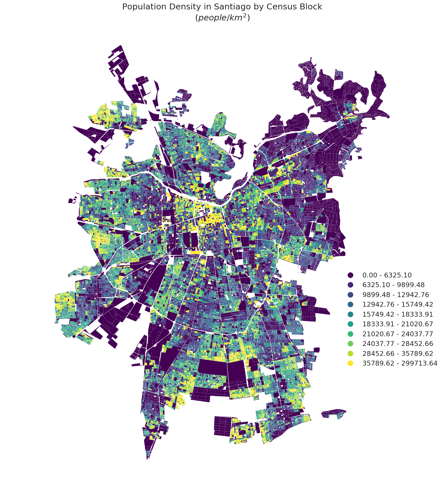

# PUI Homework 8 by Pablo Mandiola (pmb434)

## Assignment 1

For this assignment I made a plot of Population Density in Santiago (Chile) by Census Block. The data is taken from the 2017 Census and downloaded from Instituto Nacional de Estadisticas (the chilean agency in charge of the Census). The city boundary is taken from Biblioteca del Congreso Nacional.

[Link to Jupyter Notebook](HW8_1_pmb434.ipynb)

## Assignment 2

For this assignment I had to finish the Citi Bike analysis from Homework 4, perform a statistical test for my research question, and write a report on Authorea describin the analysis and results.

[Link to Authorea Report](HW8_2_pmb434.ipynb)

[Link to Jupyter Notebook](HW8_2_pmb434.ipynb)
